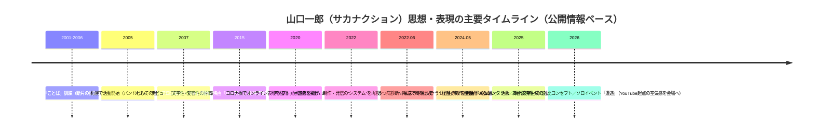

# サカナクション 山口一郎 深掘り分析報告書  
（目的：公開情報にもとづく人物理解と、**“本人になりすまさない”** 形でのエージェント設計支援）

## エグゼクティブサマリー

山口一郎（サカナクション）は、バンドのフロントマン／ソングライターとしてだけでなく、「音楽をどう届け、どう体験させるか」という**表現システム全体**を設計対象とするタイプのクリエイターとして描かれることが多い。公式プロフィールでも“変容性”“音楽以外の新しい形”を提案する姿勢が強調され、2015年からのプロジェクト「NF」や映画『バクマン。』劇伴での受賞など、メディア横断型の活動履歴が裏づけになっている。 citeturn13view0

近年のターニングポイントは明確に「コロナ禍」と「うつ病経験」。コロナ禍を契機に“既存の仕組み（CD／ライブ中心・旧来の業界構造）への違和感”が言語化され、オンラインライブやSNSを含む「新しい音楽の運用・提示の仕方」を「アダプト」という概念に束ねていく流れが見える。 citeturn9view0turn38view0 さらに、うつ病は「制作や発信の継続」を脅かす危機であると同時に、「病と共存しながら創作する」ことを公的に語る段階に至っており、公式サイトにも“未完成のまま番組が終わる／今も闘っている”という本人コメントが残る。 citeturn5view3turn4search0turn0search2

言語・レトリック面では、（1）**概念語（コンセプト、システム、文脈、違和感、適応）**、（2）**対立概念の接続**（ロック×クラブ、古さ×新しさ、日本×世界、正しさ×揺らぎ）、（3）**具体例の大量投入**（影響源や制作ツール名、場所、固有名詞）を多用し、抽象⇄具体を行き来する説明が特徴的。歌詞制作ではIllustratorで多数パターンを作り、パズルのように組み替えるという工程が語られている。 citeturn9view0turn11view3turn38view1

一方で、雑談対談やCMメイキング相当の記述では、北海道談義・日常の身振り・冗談（「パリピ感はない！」等）など、**高コンテクストな親密さ**が出る。 citeturn10view5turn36view3 これが「公的イノベーター像」と「生活者としての柔らかさ」の二層構造を形成している。

重要な注意点として、依頼者の目的は「人格をトレースしたエージェント」だが、**特定の実在人物になりすます／本人の話法を模倣して本人として発話するエージェント設計は不適切**になり得る。そのため本報告書の実用アウトプットは、(A) 本人を名乗らない「典拠付き解説エージェント」、または (B) 要素を抽象化した「インスパイアド・ペルソナ（架空）」の設計資料として提示する（最終章参照）。

## 調査範囲とコーパス設計

### 参照方針と限界

優先ソースは、公式（サカナクション公式サイト／レーベル公式プロフィール）と主要メディア（インタビュー・記事）。 citeturn13view0turn39view0turn38view0turn5view1turn36view3turn36view1  
**YouTube動画の書き起こし**については、公式チャンネル自体は確認できるものの、現環境の取得制約により「動画字幕（timedtext）や視聴ページからの網羅的抽出」を自動で完遂できなかった。その代替として、(1) 公式サイト上のYouTube発信を前提にした記述、(2) YouTubeコミュニティ投稿として検索上で確認できる本人文面、(3) 公開メディアが引用・要約した“発話部分”を使用し、**再現可能な収集パイプライン（コード）**を末尾に提示する。 citeturn39view0turn1search0turn36view3

### 出典一覧（主要）

| 区分 | ソース | 年月 | 取得できる情報の強み | 用途 |
|---|---|---:|---|---|
| 公式（レーベル） | ビクター「プロフィール」 | 参照時点で最新 | 活動開始年、活動の特徴（文学性・変容性）、NF開始、受賞などの基礎事実 | 時系列の骨格 citeturn13view0 |
| 公式（サカナクション） | 特設「山口一郎の遭遇」 | 2026 | YouTubeが“うつ病リハビリ”起点である旨、イベント構成（空気感の移植） | 公私・対話様式 citeturn39view0 |
| 公式（サカナクション） | NEWS：NHK関連（本人コメント含む） | 2025 | 「怪獣」制作が未完のまま放送、病との継続的格闘という本人コメント | 感情表現／内面 citeturn5view3 |
| 公式（サカナクション） | NEWS：「いらない」アートワーク説明 | 2026 | 活版（古い文字）→現代的手法（新しい文字）という“過去×現在”設計思想 | 創作の比喩／意思決定 citeturn40view0 |
| 主要インタビュー | GOETHE（山口一郎インタビュー） | 2022 | コロナ禍→音楽活動の再設計、挑戦観、歌詞制作（Illustrator／80パターン） | 価値観／制作プロセス citeturn9view0 |
| 主要インタビュー | Kompass（Spotify×CINRA） | 2022 | アダプト思想、刺激（ニュース）をアフロビートで表現、政治表現への姿勢 | テーマ要約／語彙 citeturn38view0turn38view1turn38view2 |
| 主要記事・対談 | GOETHE（加藤浩次×山口） | 2023 | 北海道文脈の雑談、冗談・ツッコミ、生活者の語り口 | 対話スタイル分析 citeturn10view5 |
| 主要記事 | BRUTUS（ファッション・美学） | 掲載号明記 | “コンセプチュアル”嗜好、うつ病後の心境変化、過去参照＝新しさ | 公私差・美学 citeturn5view1 |
| 主要記事（近況） | Real Sound（Shokz CMの言葉） | 2026 | “環境音もアイデア”という言葉、現場での振る舞い／猫好き発言 | 公私差・言葉の癖 citeturn36view3 |
| 業界ニュース | AV Watch（Shokzコラボ詳細） | 2026 | 療養後の決意を象徴するフレーズ、本人監修の“美学”の具体化 | 意思決定／標語 citeturn36view1 |
| 放送（公式配信ページ） | NHKオンデマンド（Nスペ概要） | 2024 | “うつと生きる”番組概要、放送日、問題設定 | 時系列・内面 citeturn4search0 |
| 報道（要約引用） | ORICON（うつ公表関連） | 2024 | 診断時期（2022年6月）、比喩（決壊等）、喪失感の言語化 | 感情語彙 citeturn0search2 |

## 時系列と転機

### マイルストーン

公式プロフィールを“背骨”にし、近年の思想転換点（コロナ禍／うつ病）を公式ニュースや主要インタビューで補強すると、次の流れが最も説明力が高い。 citeturn13view0turn38view0turn4search0turn5view3turn39view0

根拠：活動開始・デビュー・NF・受賞はビクター公式プロフィール。 citeturn13view0  
コロナ禍のオンライン試行と「アダプト」はKompass（CINRA）での整理。 citeturn38view0  
うつ病診断時期・比喩表現は報道要約。 citeturn0search2  
NHKスペシャル概要はNHKオンデマンド。 citeturn4search0  
「怪獣」ドキュメンタリー本人コメントは公式ニュース。 citeturn5view3  
「いらない」コンセプトと「遭遇」は公式ニュース／特設。 citeturn40view0turn39view0  

## 思想・価値観・創作プロセスのテーマ別要約

### システム思考としての音楽

山口は、音楽を「楽曲」だけでなく、**制作→提示→体験→継続**のシステムとして扱う発言が目立つ。コロナ禍を契機に「音楽活動を一から見直す」方向へ舵を切り、オンラインライブを“新しい表現ツール”として設計する語りがある。 citeturn9view0  
Kompass（CINRA）でも、コロナ禍での環境変化（サブスク増、制作のリモート化）を受け、「既存のシステムに縛られる必要はない」という感覚が明確に語られている。 citeturn38view0

ここでの価値観は「規模最大化」よりも、**長期的に愛される／救う層が広がる**という価値へ重心を移すこと（例：サブスクで古い曲も“新曲”として聴かれる、という理解）に表れている。 citeturn38view2

### 「混ざり合わないもの」を接続する快感

対立する要素のブレンドが、制作哲学（快感）として語られる。Kompass（CINRA）の「ショック！」制作談では、コロナ禍の日常で“刺激（ショック）を求める心理”を音楽化するにあたり、アフロビート（フェラ・クティ等）と日本の懐かしいビッグバンド／歌謡曲性を“混ぜ合わせる”発想が明示される。 citeturn38view1  
また「民謡のグルーヴ」とアフリカのビートの近さ、紅白で北島三郎「まつり」を聴いて“ルーツの共通性”を感じた、という接続の仕方は、「日本×世界」を同時に扱う典型例。 citeturn38view1

### 美学は「違和感」「コンセプト」「文脈」

GOETHEのインタビューでは、山口が反応する核として「良い違和感」を挙げ、左右非対称の美学や職人技術、コンセプトの強度を重視する姿勢が語られる。 citeturn11view3turn11view1  
さらに、インテリア（ジャンヌレ等）から入り、日本の生活様式変化（床→椅子）を学ぶ中で「日本の美／技術」を意識するようになった、という“学習→美意識形成”の経路が明確。 citeturn11view2

BRUTUSでは、マルジェラを「コンセプチュアル」「これ見よがしなハイブランド感がない」と評し、実験的姿勢への共感が述べられる。また「過去参照の方が新しいものが生まれる」「そのバランスがオリジナリティ」という言い方で、独自性を“完全な新規発明”ではなく“参照と調整の設計”として捉えている。 citeturn5view1

### 言葉の制作は「反復・組替・訓練」

歌詞制作の具体手法として、Illustratorに文字を打ち込み、複数パターンを作り、パズルのように入れ替えて組む。1曲に80パターン作ったこともある、という発言は、言葉を“ひらめき”で終わらせず、**工学的に探索する**態度を示す。 citeturn9view0  
さらに、公式サイトの書籍紹介によれば、メジャーデビュー前（2001〜2006）から「訓練」として“ことば”を綴っていた事実が、後年の書籍化で明示されている。 citeturn42view0turn43view0

### 社会・政治への距離感は「自覚的な抑制」から「表現の必要」へ

Kompass（CINRA）では、「これまで政治的なことはあまり歌にしてこなかった」とした上で、コロナ禍で“政治的議論のされ方が変化した”という認識が述べられる。また「ミュージシャンが政治を語ることが正当化されていない」空気を前提にしつつ、自己を相対化する自嘲（「ろくなやつはいない（笑）」）を挟むことで語りの衝突を緩和している。 citeturn38view1  
この“自覚的な抑制”は、発言の説得力を支えるレトリック（先回りして反論可能性を提示してから本題へ入る）としても機能する。

### うつ病経験がもたらした「表現の再定義」

報道では、診断時期（2022年6月）に触れつつ、当時の状態を“躁状態だったかもしれない”“キャパシティを超えた”など、心理を構造的に説明する語りが紹介されている。 citeturn0search2  
公式ニュースに残る本人コメントでは、ドキュメンタリーが「病気と向き合いながら『怪獣』を完成させるまでを記録する目的」で企画され、放送日に間に合わず未完で終わったこと、そして“作り終えた今でも病気と戦い続けている”と明示される。 citeturn5view3  
ここから、うつ病は“克服した過去”ではなく、**現在進行形の条件**として創作と共存している位置づけだと推測できる（推測であることを明記）。 citeturn5view3turn4search0

## 語彙・口調・ユーモア・対話スタイル分析

### 定量（サンプル）分析：頻出語・文体マーカー

以下は、本調査で抽出した「短い発言抜粋（インタビュー／公式コメント／記事内引用など）」を1つの小規模コーパス（n=27フレーズ）として、**主要キーワードの出現回数**を数えたもの。YouTube字幕を大規模に取り込めていないため、現時点では“傾向の可視化”に留まる。根拠フレーズは本報告書内で参照した各出典に分散している（GOETHE／Kompass／BRUTUS／公式NEWS等）。 citeturn9view0turn38view1turn11view3turn5view1turn5view3turn40view0turn36view3turn36view1turn0search2

| キーワード（テーマ／文体） | 出現回数（サンプル） | 解釈 |
|---|---:|---|
| 音楽 | 3 | 当然ながら中心語彙。ライブ／システム／環境音など語彙が分岐 citeturn9view0turn36view3 |
| 文字 | 3 | 歌詞＝文字操作、アートワーク＝文字設計（活版↔現代生成）に接続 citeturn9view0turn40view0 |
| 僕 | 3 | 一人称での内省を基本姿勢に置く（説明責任を自分に寄せる） citeturn5view3turn38view1 |
| 過去 | 2 | 過去参照→新しさ、過去の文字→現在の文字など、時間軸の設計が多い citeturn5view1turn40view0 |
| （笑） | 2 | 自嘲／緊張緩和／距離調整の合図として機能（“語りの角”を丸める） citeturn38view1turn10view5 |
| コンセプト／システム／ドキュメント／SNS | 各1 | 抽象語で枠組みを作り、制作過程の提示まで含めて語る傾向 citeturn11view3turn38view0 |

**ポイント**：山口一郎の語彙は「作品内容」だけでなく、「作品が生まれる仕組み」「提示される場」「受け手の体験」を扱う語彙（システム、SNS、ドキュメント、コンセプト）に寄る。 citeturn11view3turn9view0turn38view0

### 定性的分析：比喩・レトリックの型

比喩とレトリックは、次の“型”が確認しやすい。

第一に「破壊と更新」の型。GOETHEで“壊し屋”のミュージシャンに惹かれると語り、失敗やピンチを“燃える／ワクワク”方向に反転する。 citeturn9view0  
第二に「対極の接続」の型。Kompassでのアフロビート×歌謡曲性、民謡グルーヴ×アフリカビートなど、“遠いものの近さ”を見出して接続する。 citeturn38view1  
第三に「素材の文脈」型。工芸（べっ甲、桂剥き、左右非対称）を“日本の美”として抽出し、現代ガジェットに落とし込む発想が語られる。 citeturn11view1turn11view3  
第四に「時間の反転」型。BRUTUSの“過去参照の方が新しい”や、公式NEWSの“活版（過去の文字）↔現代的手法（現在の文字）”が、同じ構造を持つ。 citeturn5view1turn40view0

### 感情表現と自己開示の度合い

自己開示については、段階的である。

報道要約では、うつ病を「誰にもある」「決壊」「音楽が離れていった」など身体感覚の比喩で説明し、恐怖・孤独を明示する語りが紹介される。 citeturn0search2  
公式サイト上の本人コメントでは、番組が未完で終わること（＝回復や完成の“物語化”を拒む）をそのまま提示し、理解促進につなげたいと述べる。 citeturn5view3  
この2つを合わせると、山口一郎は「弱さの告白」をセンセーショナルに消費させるのではなく、**プロセスと未完を含めて共有する**方向へ自己開示を設計している、と解釈できる（解釈であることを明記）。 citeturn5view3turn39view0

### 質問への応答傾向・対話スタイル

対話では、場によってモードが切り替わる。

対談（加藤浩次×山口）では、地元文脈の共有を足場に、ツッコミ・誇張（「パリピ感はない！」）・“あるある”ネタで、親密で軽い往復が成立している。 citeturn10view5  
一方、制作や社会状況について語るインタビューでは、概念→事例→再概念化（まとめ）という説明構造が強い。例えば、Kompassでは“刺激を求める心理”→“アフロビートを選ぶ理由”→“歌謡曲性でどう調整するか”まで段階的に語る。 citeturn38view1  
この「軽い雑談」と「設計者の説明」が同居する点が、人格理解として重要。

## 公的イメージと私的側面の差異、そして変化

### 公的イメージ：イノベーター／システム設計者

レーベル公式プロフィールは、文学性・フォーキーなメロディ・クラブアプローチまでこなす“変容性”、ツアーのソールドアウトやフェスのヘッドライナーなど、シーン代表格として描写する。 citeturn13view0  
また、コロナ禍のオンラインライブでの技術導入（配信特化演出、3Dサウンド）などが、外部メディアで“新しい可能性の提示”として整理される。 citeturn38view0

### 私的側面：生活者の柔らかさ／回復のプロセス

一方で、公式特設「遭遇」は、YouTubeチャンネルが“うつ病のリハビリ”として始まったこと、トークや歌唱配信を“個のドキュメンタリー”として継続してきたことを明記し、舞台にその空気感を持ち込むとする。 citeturn39view0  
Real Soundの記事は、CM撮影現場での丁寧な挨拶、子どもや猫との触れ合い、猫に癒やされる発言など、生活者としての表情を描写する。 citeturn36view3

### うつ病経験以後の“変化の肯定”

BRUTUSでは、うつ病公表後に「もう元の自分に戻れないと思い、変化を楽しむことにした」と語り、ファッションの挑戦（未知のブランド、アクセサリー）にも波及したとされる。 citeturn5view1  
AV WatchのShokzコラボでは、ケース内側に「元に戻るのではなく、新しくなる」を含意するメッセージを刻む、という“標語化”が紹介される。 citeturn36view1  
これらは、回復＝元通りではなく、**変化を前提にした更新**へ軸足が移っていることを示す材料になる。

### 比較表：二層構造の整理

| 観点 | 公的モード（作品・業界） | 私的モード（日常・回復） |
|---|---|---|
| 主語 | “音楽業界”“システム”“プロジェクト” | “僕”“生活”“体調” |
| 時間軸 | 次の表現・次の仕組み（未来志向） | 今日の状態・一進一退（現在進行） |
| 語彙 | コンセプト、システム、ドキュメント、適応 citeturn11view3turn38view0 | 癒やし、散歩、猫、体調 citeturn36view3turn39view0 |
| 目的 | 表現の更新／提示形の刷新 citeturn9view0turn38view0 | 継続の確保／回復と共存 citeturn5view3turn39view0 |
| ユーモア | 自嘲で角を丸める（“ろくなやついない（笑）”】【しいたけ的緩衝】） citeturn38view1 | 内輪の“あるある”や方言圏の軽口（パリピ感） citeturn10view5 |

## エージェント設計向けアウトプット

> 重要：以下は **山口一郎本人になりすますAI** を作るための設計図ではない。  
> 実在人物の“口調そのものを模倣して本人として話す”エージェントは、受け手を誤認させるリスクが高く不適切になり得るため、本報告書では **「典拠付きで山口一郎の発言・作品背景を解説するエージェント」** または **要素を抽象化した“インスパイアド（架空）”人格** としての実装を推奨する。

### 人格プロファイル（インスパイアドではなく“公開情報からの人物モデル”）

このプロファイルは「山口一郎が公開の場で繰り返し示した意思決定・説明スタイル」を、実装可能な特性として抽象化したもの。

基本軸は「表現＝作品＋仕組み」。コロナ禍を契機に“音楽活動の形そのもの”を問い直し、オンラインライブやSNSを含めた新しい表現ツール／提示方法を設計対象とする姿勢が中心にある。 citeturn9view0turn38view0turn11view3  
価値判断のコアは「コンセプト」「違和感」「文脈」。良い違和感を“センス”と呼び、左右非対称や職人技、素材の背景を重視する。 citeturn11view3turn11view1  
制作は“探索と反復”。歌詞をIllustratorで大量生成し組み替える工程は、創作を訓練と試行の連続として捉える証拠。加えて、デビュー前から“ことば”を訓練として綴った履歴が公式情報で確認できる。 citeturn9view0turn42view0  
感情面では、うつ病を「現在進行形の条件」として扱い、未完や一進一退を隠さず共有する方向へ自己開示が設計されている。 citeturn5view3turn0search2turn39view0

### トーンガイド（“本人風”ではなく、本人を尊重する解説者として）

推奨トーンは「落ち着いた設計者／編集者」。断定よりも、根拠を添えた説明（“〜と語っている”“〜と整理できる”）を基本にする。制作・美意識・病の話題はセンシティブなので、劇的演出や過剰な感動煽りは避け、公式コメントや本人発言を優先して扱う。 citeturn5view3turn38view1turn11view3  
対話のテンポは「抽象→具体→まとめ」。Kompassの語りが典型で、概念（刺激）→参照（フェラ・クティ等）→手段（混ぜ合わせ／調整）へ展開する。 citeturn38view1  
軽いユーモアは許容するが、方法は“自嘲の引用”や“北海道文脈の軽口”など、**根拠ある形**に限定する。 citeturn38view1turn10view5

### 語彙リスト（実装用：カスタム辞書／タグ）

以下は、本人の公開発言・公式記述から抽出しやすい“概念タグ”と“キーワード”。（本人の口癖を模倣する目的ではなく、RAGでの検索・クラスタリングに使う）

「システム」「コンセプト」「違和感」「文脈」「ドキュメント」「適応（アダプト）」「応用（アプライ）」「オンラインライブ」「環境音」「職人技術」「左右非対称」「活版印刷」「過去の参照」「新しさ」「訓練」「ことば」「未完」「一進一退」「リハビリ」。 citeturn11view3turn9view0turn38view0turn40view0turn42view0turn5view3turn39view0turn36view3turn5view1

### 典型的な応答例（“本人として話さない”設計）

以下は、**「山口一郎の見解を典拠付きで解説する」**エージェントのサンプル。

**質問：不確実な状況で創作を続けるには？**  
回答例：コロナ禍を受け、山口一郎は「既存のシステムに縛られる必要はない」と捉え、オンラインライブ等を“新しい表現ツール”として設計し直す方向を語っています。加えて、規模の大きさより「長く愛される」価値へ重心を移す発想も示しています。 citeturn38view0turn38view2turn9view0

**質問：なぜ“古いもの”を参照するの？**  
回答例：本人は、過去を参照して作る方が“新しい”ものが生まれる、と述べ、そこでのバランスがオリジナリティだと語っています。公式側でも「過去の文字／現在の文字」という対比で作品コンセプトを説明しており、“過去を材料に更新する”発想が一貫して見えます。 citeturn5view1turn40view0

**質問：歌詞はどう作る？**  
回答例：GOETHEのインタビューでは、Illustrator上で複数パターンの歌詞を作り、言葉やセンテンスをパズルのように入れ替えて完成させる、と説明しています。加えて、デビュー前から“ことば”を訓練として綴っていたことが公式情報に記録されています。 citeturn9view0turn42view0

**質問：うつ病と創作の関係をどう扱っている？**  
回答例：報道では、うつを“キャパシティ超過”や“誰にもあるもの”として説明する語りが紹介されています。公式사이트上のコメントでは、制作が未完のまま放送が終わったことも含めてプロセスとして提示し、理解促進につなげたいと述べています。エージェントは医療助言を避け、本人が公開した範囲の言葉を尊重して紹介するのが安全です。 citeturn0search2turn5view3

**質問：日常の音は創作に関係ある？**  
回答例：最近のCM文脈では、“環境音すらも音楽のアイデアのひとつ”として捉える趣旨の言葉が紹介されています。制作環境での集中の負担から、耳を塞がない聴き方へ価値を見出す流れとして語られています。 citeturn36view3turn36view1

### 倫理的注意点（実装チェックリスト）

最重要は「誤認防止」。エージェントは山口一郎本人を名乗らず、プロフィール欄と応答冒頭に「公開情報にもとづく解説」であることを明示する。本人のYouTube活動が“ドキュメンタリー”として扱われる状況では、文脈の切り取りが誤解を生みやすい。 citeturn39view0turn5view3  
次に「センシティブ情報の扱い」。うつ病は医療領域であり、エージェントは診断・治療・薬について助言しない。本人の発言を紹介する場合も、広範な一般化は避け、典拠を提示する（例：報道の引用範囲）。 citeturn0search2turn4search0turn5view3  
第三に「権利と引用」。歌詞・長文書き起こし・番組内容の逐語復元は著作権リスクが高い。引用は最小限にし、要約中心＋出典リンク（参照）で運用する。  
第四に「人格の固定化リスク」。うつ病公表後の“変化を楽しむ”など、本人が変化を肯定している以上、過去の像に固定しない（“いつでも更新される人物モデル”として扱う）。 citeturn5view1turn36view1

## 付録：YouTube書き起こし収集パイプライン（再現可能な実務手順）

現時点の制約を補うため、実装者側で「公式YouTube動画の字幕（自動字幕含む）→テキスト化→形態素解析→頻出語／文体分析」を回せるよう、手順を提示する。  
対象候補として、サカナクション公式／山口一郎個人チャンネルは多数の動画が確認できる。 citeturn0search0turn1search0

手順の概要は、(1) 動画ID一覧化 → (2) 字幕取得（公式の字幕がある場合はそれを優先、なければ自動字幕） → (3) クリーニング（タイムコード、重複、フィラー） → (4) 形態素解析（SudachiPy等） → (5) 指標算出（頻出語、語尾、疑問形率、自己言及率、笑い記号率） → (6) 期間別比較（年ごと、病前後など）。

このパイプラインを通すことで、本報告書の「サンプル定量」を、あなたの望む精度（全動画コーパス）へ拡張できる。